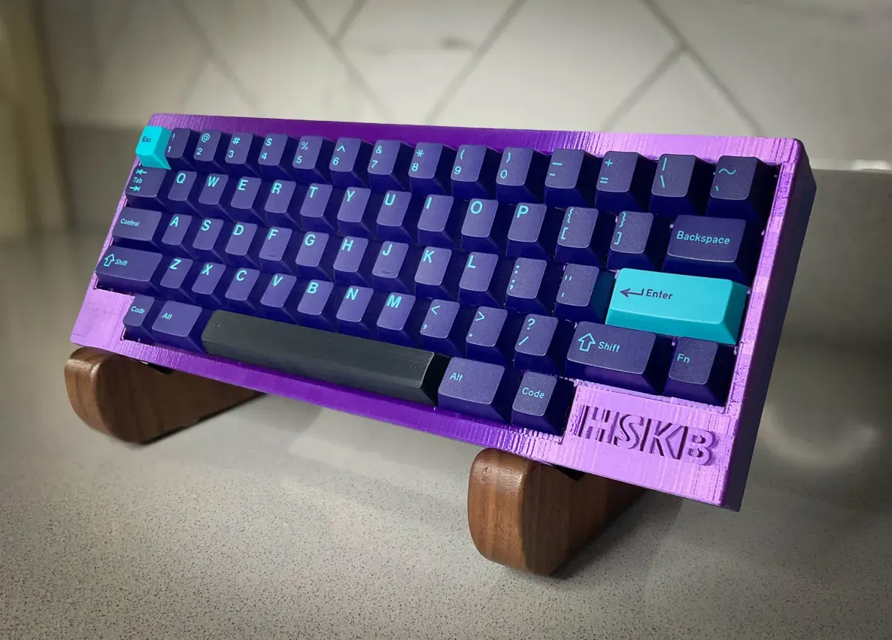

# HSKB – Happy Sabi KeyBoard




## About the HSKB

The HSKB is a custom mechanical keyboard inspired by the minimalist layout and functionality of the HHKB (Happy Hacking Keyboard). It reflects a philosophy of simplicity, precision, and personal expression.

Designed with a true HHKB layout, the HSKB features a 6u spacebar and an integrated plate design that supports both plate-mounted and PCB-mounted stabilizers. Drawing inspiration from the legendary HHKB and driven by a passion for thoughtful design and community collaboration, this project has been a personal journey—learning new software, iterating through multiple prototypes, and spending approximately three months refining every detail.

I am excited to share the HSKB with the open-source community and hope it inspires others to create and contribute. This project would not have been possible without the support and inspiration from the keyboard community.

## Why Choose the HSKB?

Many keyboards with a similar HHKB-inspired layout are often positioned as luxury items, carrying a high price tag and limited customization options. The HSKB offers a more affordable entry point without sacrificing quality or flexibility. Its open-source nature means you can modify and adapt it to suit your preferences—whether it's changing the key mapping, adjusting the stabilizers, or customizing the case.

The HSKB provides a unique balance of cost-efficiency and personalization. It's an excellent option for enthusiasts looking to explore the HHKB layout without breaking the bank. Whether you're new to mechanical keyboards or an experienced hobbyist, the HSKB offers a rewarding, hands-on experience while remaining accessible and adaptable.

## Unity Switch & Andy's Man Club

This project is also inspired by **Matty's Unity switch**, created in support of **Andy's Man Club**, a mental health charity promoting open conversations and community support. As part of this commitment, one of the five initial HSKBs will be donated to a charity raffle to raise funds for this meaningful cause.

If you use or modify this project, please consider supporting **Andy's Man Club** or a mental health charity in your community.

- https://andysmanclub.co.uk/
- https://thoccexchange.com/

## Features

- **Minimalist Layout** – Inspired by the HHKB design
- **Custom PCB & Case Files** – Fully customizable and open-source (thanks to **TheVoid** for helping with this)
- **Community-Driven** – Built with love, feedback, and support

## What's Included

- [PCB design files (KiCad)](https://github.com/Dev01-D/HSKB/tree/main/PCB%20Files)
- [Case design files (STEP, STL for 3D printing)](https://github.com/Dev01-D/HSKB/tree/main/HSKB%20STL)
- [Firmware configuration (QMK/VIA-compatible)](https://github.com/Dev01-D/HSKB/tree/main/Firmware)

## Getting Started

1. **Clone the repository:**
    ```bash
    git clone https://github.com/Dev01-D/hskb.git
    cd hsbk
    ```

2. **Explore the design files:**
   - PCB files: Located in the `/pcb` directory
   - Case files: Located in the `/case` directory
   - Firmware: Instructions in `/firmware` for flashing QMK/VIA

3. **Manufacture & Build:**
   - Order your PCB from your preferred manufacturer
   - Print the case using the provided STL files
   - Assemble the board using the included BOM (Bill of Materials)

## Contributing

Contributions and improvements are welcome! Feel free to submit issues, pull requests, or ideas to enhance the HSKB.

1. Fork the repository
2. Create a new branch
3. Submit a pull request

## License

This project is released under the **MIT License** – you're free to use, modify, and share it. Please credit this repository if you share your own builds.

## Support

If you build your own HSKB, I would love to see it! Share your creations and thoughts.

Consider donating to **Andy's Man Club** or any mental health charity to help continue supporting important community work.

Thank you for being a part of the journey.

**Happy building!**
